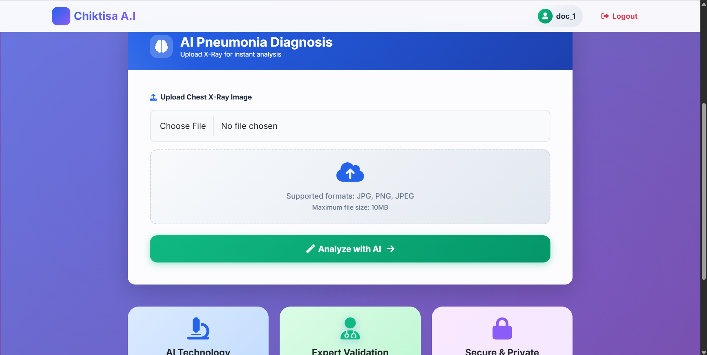
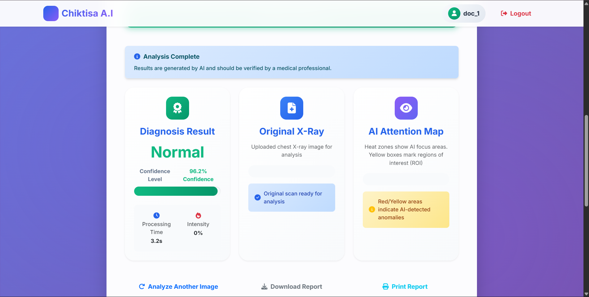

# CHIKITSA_AI: AI-Powered Multi-Disease Detection

**CHIKITSA_AI** is a project that utilizes multiple Artificial Intelligence (AI) and Machine Learning models for the detection of various diseases. This project aims to assist in diagnostics using computational methods.

## 💡 About the Project

*   **Motivation:** (Describe the problem that inspired this project, e.g., the need for rapid, data-driven diagnostic support in healthcare.)
*   **Problem Solved:** (Explain how this application helps healthcare professionals by automating certain aspects of disease detection.)
*   **Features:**
    *   Integration of multiple A.I. models.
    *   Image processing for X-ray analysis.
    *   Web interface built with Flask for easy interaction.

## 🛠️ Technologies Used

*   **Languages:** Python, HTML, CSS, JavaScript
*   **Framework:** Flask
*   **Key Libraries:** TensorFlow/Keras, likely scikit-learn or similar data science libraries.

## 🏃 Getting Started

### Prerequisites

Make sure you have Python installed on your system.

### Installation and Setup

1.  **Clone the repository:**
    ```bash
    git clone github.com
    ```
2.  **Navigate to the project directory:**
    ```bash
    cd CHIKITSA_AI
    ```
3.  **Install dependencies:**
    ```bash
    pip install -r requirements.txt
    ```

### Usage

1.  **Run the application:**
    ```bash
    python run.py
    # or
    python app.py
    ```
2.  **Access the web interface:** Open your web browser and visit `127.0.0.1`.

## 📊 Screenshots

Here are screenshots of the application in action:

*   **Dashboard View:**
    

*   **Results Page:**
    

*   **Additional View:**
    

## 🤝 Contributing

We welcome contributions! Please fork the repository and open a pull request with your suggested improvements.

## 📧 Contact

*   **Owner:** [MOHDSAIF3308](github.com)
*   (Add your email, LinkedIn, or personal website here.)

## 📜 License

(Specify your project's license here, e.g., "This project is licensed under the MIT License.")
